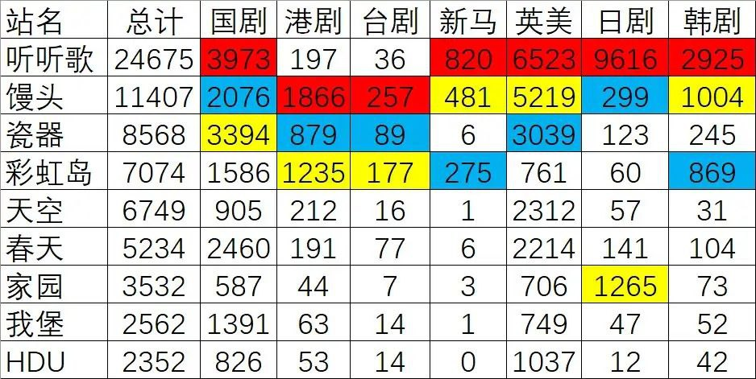

# PT站点介绍

## PT站点数据

那个思维导图就不上了，从数据上看看各站的长项吧

国内 PT 站可以划分为两个系别：**教育网 PT 站** 与 **公网 PT 站**。

## 教育网 PT 站点

以[北邮人](http://bt.byr.cn/)（北京邮电大学）、[蒲公英](https://npupt.com/)（西北工业大学）、[极速之星](http://bitpt.cn/)（北京理工大学）和[六维空间](http://bt.neu6.edu.cn/)（东北大学）为主。

高校校园网提供的 IPv4 网络一般是有计费及限速策略的，由校方向电信、联通、移动、鹏博士等运营商采购带宽并在出口实施自动分流。而为了推广 IPv6 业务，各高校所接入的中国教育网（CERNET）的 IPv6 网络一般是不计费且不限速的，因此组建一个依托于 IPv6 的免费资源分享网络有着很大意义。

一般来说，教育网 PT 站的原创影视资源较少，大部分为转载资源。Coursera、Udacity 等公开课资源（WEB-DL）、考研视频、电子书等内容较多，此外，北邮人等站点还提供一些诸如 Steam 游戏数据备份文件，这样学生就不用担心被几十个 G 的 Steam 游戏更新榨干网费了。

目前来看教育网 PT 站或多或少获得了学校网络中心的技术和政策支持，所以才能存留至今。部分教育网 PT 站仅允许 IPv6 或仅归属于教育网 ASN 的 IPv6 访问，因此对于公众来说访问有些难度，可以通过 HE.net 提供的 IPv6 TunnelBroker 隧道，或者 IPv6 VPS 来中转流量。

从分享率和发种规范来看，教育网 PT 十分宽松，但保种率可能不如公网 PT 站高，资源也没那么丰富。但对于追热门电影和美剧的轻度用户来说还是足够了。

## 公网 PT 站点

传说中国有五大公网 PT 站：HDS、TTG、HDC、CHD、HDR，也有三大 PT 站的说法（即 CHDbits、HDChina、TTG）。后来经过世界版权日风波（即被称作“中国版权第一案”的思路网侵权案），[HDStar（思路网）管理组被捕入狱](https://zh.wikipedia.org/wiki/%E6%80%9D%E8%B7%AF%E7%BD%91)，剩下的站点也多多少少受到了一些影响，有些直接关闭了，有的则隐没了。

希望考古中国 PT 站历史的朋友可以查看这个帖子：[国内外PT站点评](https://web.archive.org/web/20210404133244/https://www.douban.com/group/topic/27989385/)。希望考古国际 PT 站的朋友，可以查看这个帖子：[PT站点大全](https://web.archive.org/web/20201121094012/https://www.douban.com/group/topic/32448115/)。历史比较悠久了，仅供参考。

距离版权日风波已经过去了七八年，现在国内 PT 站又呈现出繁荣景象。一方面国内电视剧集的分级制度迟迟未推出，而 Netflix、HBO、Disney+、Apple TV+ 等境外流媒体业务的订阅费用也居高不下。另一方面，国内百兆、千兆家庭宽带已经覆盖到了三四线城市甚至是县城，养一个 PT 账号的成本已经相当低了。

在此列出几个常见的站点，仅供参考。

* 目前以影视资源为主的有
  * [HDChina 瓷器](https://hdchina.org/)：近 10 年的老站，用户数据继承自原先的 HDWinG 和 HDStar。资源方面，官方制作组（HDCTV 和 HDChina）的 Netflix、HBO 剧集，原盘，录制的电视剧比较多。
  * [CHDbits 彩虹岛](https://chdbits.co/)：近 10 年的老站点，影视资源很丰富。
  * [SSD (Spring Sunday)](https://springsunday.net/)：2010 年创建的老站点，前身为 CMCT 触摸春天。
  * [M-Team 馒头](https://www.m-team.cc/)：有比较多的成人内容，官方提供付费邀请码购买渠道。
  * [BT School 比特校园](https://pt.btschool.club/)：2019 年刚创建的新站点，门槛相对比较低。
  * [HD Time 高清时间](https://hdtime.org/)：老站点，但是没什么名气。
  * [52PT 我爱PT](https://52pt.site/)：新站点。
  * [HDSky 天空](https://hdsky.me/)：综合站点。
  * [TTG](https://totheglory.im/upload.php)：国内大站之一，2014 年末作为 TTG 出现。
  * [Ourbits 我堡](https://ourbits.club/)：算是国内大站了，没啥特色。
  * [HDHome 家园](https://hdhome.org/)：2015 年左右成立的 PT 站，没啥特色。
  * [PTHome 铂金家](http://www.pthome.net/)：2018 年左右成立的新站，没啥特色。
  * [HDCity 城市](https://hdcity.city/)：2016 年底成立的新站（相对来说）。
  * [NicePT 老师站](https://www.nicept.net/)：又成为小馒头（相对于 M-Team 来说），主要为成人内容。
  * [CCFBits 精品高清](http://ccfbits.org/)：挺老的大站了，资源很丰富也很低调。
  * [HDR (HDRoute)](http://www.hdroute.org/)：前身为 HDRoad 思路高清，历史悠久。
  * [LeagueHD 柠檬](https://lemonhd.org/)：小站中发展的还算不错的，2019 年成立。
  * [Haidan 海胆之家](https://www.haidan.video/)：2020 年刚成立的小站。
* 教育网 PT，部分 tracker 可能仅允许教育网或 IPv6 连接。入站门槛较低，可以凭借 edu 教育域名的邮箱进行注册，也可以通过校内用户发起邀请。对分享率和种子规范的限制比较宽松。
  * [NanyangPT 南洋](https://nanyangpt.com/)：西安交通大学 PT 站
  * [BYR 北邮人](https://byr.pt/)：北京邮电大学 PT 站，仅对 IPv6 开放
  * [TJUPT 北洋园](https://www.tjupt.org/)：天津大学 PT 站
  * [葡萄PT](https://pt.sjtu.edu.cn/)：上海交通大学 PT 站
  * [NPUPT 蒲公英](https://npupt.com/)：西北工业大学 PT 站
  * [BITPT 极速之星](http://bitpt.cn/)：北京理工大学 PT 站
  * [六维空间](http://bt.neu6.edu.cn/)：东北大学 PT 站
  * [NexusHD](https://nexushd.org/)：浙江大学 PT 站，仅供校内用户访问。
* 以动漫资源为主的有
  * [U2 动漫花园 幼儿园](https://u2.dmhy.org/)：老牌动漫 PT 站。各种上古资源都能找到。
  * [Skyey Snow 天雪动漫](https://www.skyey2.com/)：基于 Discuz! 构建的 PT 站点，相对来说新一些。
* 以音乐资源为主的有
  * [OpenCD 皇后 PT](https://open.cd/)：小体积种子比较多，基本靠攒魔力值来保号。
